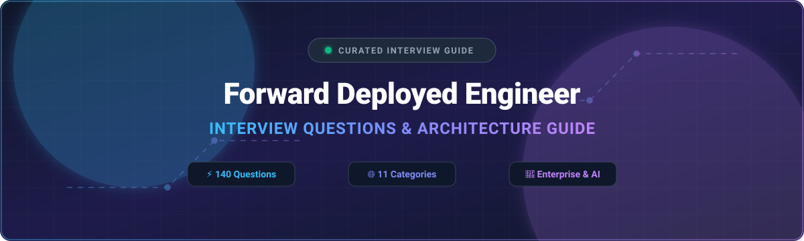

  

<h1 align="center">🚀 Forward Deployed Engineer — Interview Questions 🚀</h1>

  
  
  
  
  
  

  <b>A curated, battle-tested collection of 140 interview questions & comprehensive answers for Forward Deployed Engineer (FDE), Solutions Architect, Field Engineer, and Deployment Engineering roles across AI & Enterprise Tech.</b>

---

### 💡 What is a Forward Deployed Engineer (FDE)?

A distinctive software engineering role popularized by **Palantir** and now adopted across leading AI, data, and enterprise software companies. The role is defined less by a specific technical stack and more by *how* the work happens: **embedded directly with enterprise customers**, building and rapidly adapting real software against messy, high-stakes operational problems under significant ambiguity.

It combines core software engineering (data integration, application development, systems design) with a customer-facing, product-discovery orientation and direct ownership of outcomes.

---

> 📢 **Disclaimer:** This is a community knowledge base, not an official curriculum. Answers aim to be technically sound and interview-appropriate — concise, structured, demonstrating clear reasoning.

---

## 📚 Contents

| # | Category | File | Questions |
|---|----------|------|-----------|
| 1 | 🛠️ FDE Role Fundamentals & Working Model | [`questions/01-fde-role-fundamentals-working-model.md`](questions/01-fde-role-fundamentals-working-model.md) | 16 |
| 2 | 🔍 Requirements Discovery & Ambiguity | [`questions/02-requirements-discovery-ambiguity.md`](questions/02-requirements-discovery-ambiguity.md) | 16 |
| 3 | 🔄 Data Integration & Enterprise Systems | [`questions/03-data-integration-enterprise-systems.md`](questions/03-data-integration-enterprise-systems.md) | 18 |
| 4 | ⚡ Rapid Application Development & Architecture | [`questions/04-rapid-application-development-architecture.md`](questions/04-rapid-application-development-architecture.md) | 14 |
| 5 | 🚀 Deployment Environments & Operational Constraints | [`questions/05-deployment-environments-operational-constraints.md`](questions/05-deployment-environments-operational-constraints.md) | 12 |
| 6 | 🛡️ Security, Compliance & Enterprise Trust | [`questions/06-security-compliance-enterprise-trust.md`](questions/06-security-compliance-enterprise-trust.md) | 12 |
| 7 | 🏗️ From Prototype to Product | [`questions/07-from-prototype-to-product.md`](questions/07-from-prototype-to-product.md) | 11 |
| 8 | 🤖 AI/ML in Forward-Deployed Contexts | [`questions/08-ai-ml-in-forward-deployed-contexts.md`](questions/08-ai-ml-in-forward-deployed-contexts.md) | 11 |
| 9 | 🤝 Stakeholder Management & Customer Relationships | [`questions/09-stakeholder-management-customer-relationships.md`](questions/09-stakeholder-management-customer-relationships.md) | 11 |
| 10 | 📐 System Design / Case Studies | [`questions/10-system-design-case-studies.md`](questions/10-system-design-case-studies.md) | 3 |
| 11 | 🗣️ Behavioral & Cross-Functional | [`questions/11-behavioral-cross-functional.md`](questions/11-behavioral-cross-functional.md) | 16 |

🎯 **Total: 140 questions with detailed answers.**

---

## 🧭 How to Use This Repo

- 🎯 **Candidates:** Work through categories in order — role fundamentals (1) and requirements discovery (2) establish the mindset. System design (10) and behavioral (11) are key evaluation points in real interview loops.
- 🎙️ **Interviewers:** Pick 1–2 questions per category to evaluate tradeoffs and problem-solving under ambiguity.
- 💡 **Everyone:** Focus on the *reasoning* and architectural trade-offs behind each answer.

---

## 🗂️ Difficulty Tags

- 🟢 **Foundational** — Expected of any candidate
- 🟡 **Intermediate** — Mid-level, role-specific depth
- 🔴 **Advanced** — Senior/Staff-level, open-ended architecture or edge cases

---

## 🤝 Contributing

Contributions are welcome! See [`CONTRIBUTING.md`](CONTRIBUTING.md) for guidelines.

---

## 📄 License

[CC BY-SA 4.0](LICENSE) — Free to use and adapt with attribution.

---

## 📈 Star History

<a href="https://www.star-history.com/?repos=ishandutta2007%2FForward-Deployed-Engineer-Interview-Questions&type=date&legend=bottom-right">
<picture>
<source media="(prefers-color-scheme: dark)" srcset="https://api.star-history.com/chart?repos=ishandutta2007/Forward-Deployed-Engineer-Interview-Questions&type=date&theme=dark&legend=bottom-right" />
<source media="(prefers-color-scheme: light)" srcset="https://api.star-history.com/chart?repos=ishandutta2007/Forward-Deployed-Engineer-Interview-Questions&type=date&legend=bottom-right" />

</picture>
</a>

